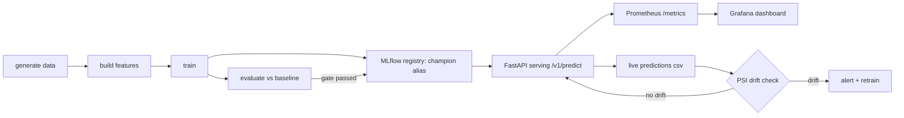

<div align="center">

# mlops-pipeline — End-to-End ML Model Lifecycle

A production-shaped MLOps showcase: **data → features → training → experiment tracking → model registry → serving → monitoring → drift detection**.

**Python 3.12 · scikit-learn · MLflow 3.x · DVC · FastAPI · Prometheus/Grafana · Docker · GitHub Actions**

[](https://github.com/krish10021995/mlops-pipeline/actions/workflows/ci.yml)
[](https://www.python.org)
[](https://mlflow.org)
[](https://scikit-learn.org)
[](https://fastapi.tiangolo.com)
[](LICENSE)

</div>

---

## What this demonstrates

> **The client question this answers:** *"Can you take a model from a notebook to a served,
> monitored, versioned API — and prove it with engineering discipline?"*

- **Experiment tracking + Model Registry (MLflow 3.x)** — every training run records
  hyperparameters, metrics, and the model artifact. Registered versions are promoted or rolled
  back via **aliases** (`champion`), not copy-pasted zip files.
- **Reproducible pipelines (DVC)** — stages are declared in `pipelines/dvc.yaml`; `dvc repro`
  re-runs only what changed, so data, features, and model are all re-linkable to one another.
- **Evaluation with a promotion gate** — models must beat a naive baseline on the test split
  (RMSE / MAE / R², time-ordered split) or promotion is blocked.
- **Live serving (FastAPI)** — typed request/response models, automatic Swagger docs,
  Prometheus metrics, and prediction logging.
- **Monitoring + Drift (PSI)** — the trained fare distribution is compared against live
  prediction traffic; the drift job exits non-zero when the distribution shifts.
- **CI/CD** — lint (`ruff`), unit tests, and an end-to-end `data → features → train →
  evaluate` smoke run on every push; a manual AWS deploy workflow builds the image, pushes to
  ECR, and redeploys ECS Fargate.

**Reference numbers from the default run** (50k rows): validation RMSE **5.15** (R² **0.88**),
test RMSE **4.00** (R² **0.94**) — a **76% improvement** over the naive-fare baseline.

---

## Table of contents

- [Architecture](#architecture)
- [Pipeline stages](#pipeline-stages)
- [Dataset](#dataset)
- [Feature engineering](#feature-engineering)
- [Training & evaluation](#training--evaluation)
- [Serving API](#serving-api)
- [Monitoring & drift](#monitoring--drift)
- [Configuration reference](#configuration-reference)
- [Getting started](#getting-started)
- [Testing](#testing)
- [Deployment](#deployment)
- [Project structure](#project-structure)
- [Troubleshooting](#troubleshooting)
- [Roadmap](#roadmap)

---

## Architecture



**Where each layer runs:**

| Layer             | Runs where (local)            | Runs where (cloud)                    |
| ----------------- | ----------------------------- | ------------------------------------- |
| Pipeline          | your machine, `make`, DVC     | GitHub Actions (`ci.yml`), CI runners |
| MLflow tracker    | SQLite (`mlflow.db`)          | MLflow server (managed / self-hosted) |
| Serving           | `mlops-serve`, uvicorn        | Docker → ECR → ECS Fargate (`cd.yml`) |
| Metrics           | Prometheus + Grafana (compose)| Managed Prometheus / Grafana Cloud    |

---

## Pipeline stages

| Stage        | Command               | Input → Output                                    | What it proves                    |
| ------------ | --------------------- | ------------------------------------------------- | --------------------------------- |
| Generate     | `mlops-data`          | `data/raw/trips.parquet`                          | Deterministic, reproducible data  |
| Features     | `mlops-features`      | `raw → data/features/features.parquet`            | Real feature engineering + cleaning |
| Train        | `mlops-train`         | `features → artifacts/taxi-fare-model.joblib`     | MLflow tracking + registry        |
| Evaluate     | `mlops-evaluate`      | `model + features → artifacts/eval_metrics.json`  | Baseline gate                      |
| Predict      | `mlops-predict`       | `features + model → predictions`                  | Batch prediction                  |
| Serve        | `mlops-serve`         | `model → REST API`                                | Production loading path           |
| Drift        | `mlops-drift`         | `live.csv vs reference → drift_report.json`       | Distribution monitoring           |

The same stages are declared as DVC pipeline in `pipelines/dvc.yaml`; run them all with
`dvc repro` (from the repo root) and DVC handles caching + incremental runs.

---

## Dataset

**Problem:** predict the total fare of an NYC taxi trip (USD) from pickup/dropoff time,
distance and passenger count.

Synthetic data, 30 days of trips from `2024-11-01`, seasoned to look like real TLC records:

| Column             | Description                                   |
| ------------------ | --------------------------------------------- |
| `pickup_datetime`  | ISO timestamp of pickup                       |
| `dropoff_datetime` | ISO timestamp of dropoff                      |
| `trip_distance`    | distance in miles (log-normal, 0.2–60 mi)     |
| `passenger_count`  | 1–5                                           |
| `fare_amount`      | target — `3.00 + 2.50·mi + 0.35·min` + noise  |
| `rate_code`, `vendor_id` | trip metadata (informational)          |

Generation is deterministic (`seed: 42` in `config/config.yaml`) so every run is identical —
this is what makes the pipeline reproducible and demo-safe.

**Swap in real data:** to use real NYC TLC parquet files instead, drop them into
`data/raw/` and point `config.yaml → data.raw_path` at the file. Track real datasets with DVC
(`dvc add data/raw/trips.parquet`) so raw data is never committed to git.

---

## Feature engineering

`mlops/features/build.py` turns raw trips into the 9 model features:

| Feature         | Derivation                              | Why it matters                    |
| --------------- | --------------------------------------- | --------------------------------- |
| `trip_distance` | raw                                     | primary fare driver               |
| `passenger_count` | raw                                  | fare-up rounding (directly + through duration) |
| `hour`          | from `pickup_datetime`                  | rush hour / overnight pricing     |
| `dow`           | day-of-week (0=Mon)                     | weekend rates / demand            |
| `is_weekend`    | `dow >= 5`                              | explicit weekend signal           |
| `is_rush`       | 7–10 and 16–20 windows                  | congestion surcharge proxy        |
| `duration_min`  | `dropoff - pickup` (minutes)            | time-based fare component         |
| `speed_mph`     | `distance / duration`                   | detects outliers (impossible speeds) |
| `log_distance`  | `log1p(distance)`                       | tames long-tail trips             |

Cleaning rules: drop rows with missing features, enforce `duration >= 1 min`, drop
impossible speeds (`> 80 mph`), and deduplicate by pickup time.

---

## Training & evaluation

`mlops/models/train.py`

- **Split:** chronological (time-ordered) — train 70% / validation 15% / test 15%. We *never*
  shuffle time series, so validation mirrors "predicting the future".
- **Model:** `HistGradientBoostingRegressor` (gradient-boosted trees, NaN-safe, fast) —
  swappable via `config.yaml → model.type` (a `RandomForestRegressor` factory is included).
- **Tracked:** hyperparameters, validation RMSE/MAE/R², row counts, model artifact, and a
  run_id per fit.
- **Registry:** `mlops-train --register` registers the model and attaches the `champion`
  alias to the newest version. Load back with `mlops-predict` (registry) or by `MODEL_PATH`
  (local artifact) — the serving app supports both.

`mlops/models/evaluate.py`

- Computes **test RMSE / MAE / R²** on the held-out time window.
- Compares against a **naive baseline** (predicting the train-set median fare for every trip).
- `--gate` fails (exit 1) if the model doesn't beat the baseline — a promotion gate you would
  wire into CD so bad models can never ship.
- Writes `artifacts/eval_metrics.json` with every metric for alerting/dashboards.

---

## Serving API

`mlops/serving/api.py` — FastAPI, Swagger docs at `/docs`.

| Endpoint      | Method | Purpose                                                       |
| ------------- | ------ | ------------------------------------------------------------- |
| `/health`     | GET    | liveness + model loaded + run_id                              |
| `/v1/predict` | POST   | predict a fare from trip inputs                               |
| `/metrics`    | GET    | Prometheus exposition format                                  |

**Request:**

```json
// POST /v1/predict
{
  "pickup_datetime": "2024-11-10T09:30:00",
  "dropoff_datetime": "2024-11-10T09:48:00",
  "trip_distance": 6.2,
  "passenger_count": 2
}
```

**Response:**

```json
{ "prediction": 33.97, "model_run_id": "58546397e7904d05a1f1d2ad683eed0f" }
```

Input validation (returns HTTP 422 on violation): `trip_distance` in `(0, 100]`,
`passenger_count` in `[1, 9]`, both datetimes must parse as ISO 8601.

**Exposed Prometheus metrics:**

| Metric                         | Type      | Meaning                         |
| ------------------------------ | --------- | ------------------------------- |
| `predict_requests_total`       | Counter   | total predict calls             |
| `predict_errors_total`         | Counter   | failed predict calls            |
| `predict_latency_seconds`      | Histogram | latency buckets up to 5 s       |
| `prediction_last_value`        | Gauge     | most recent fare prediction     |

Every successful prediction is also appended to `data/predictions/live.csv` — the input for
the drift job.

---

## Monitoring & drift

`mlops/serving/drift.py`

- The `mlops-drift` job computes the **Population Stability Index (PSI)** between the
  predicted-fare distribution and the training-time fare distribution:
  `PSI = Σ (act−exp)·ln(act/exp)` over 10 bins.
- `PSI < 0.1` minor, `0.1–0.2` moderate, `> 0.2` — **drift detected**; the job exits non-zero
  so a scheduler/CI can page someone.
- Writes `artifacts/drift_report.json`:
  ```json
  { "metric": "predicted fare vs trained fare", "psi": 0.05,
    "threshold": 0.2, "drift_detected": false, "samples": 240 }
  ```

The Docker Compose stack provisions **Prometheus** (scrapes the API every 15s) and
**Grafana** with a pre-built "Taxi Fare API" dashboard (QPS, p50 latency, last prediction) —
no manual setup, just `docker compose up`.

---

## Configuration reference

All runtime configuration lives in `config/config.yaml` (overridable with `MLOPS_CONFIG`).

| Key                            | Default                              | Overridable env var   |
| ------------------------------ | ------------------------------------ | --------------------- |
| `data.n_rows` / `data.seed`    | `50000` / `42`                       | CLI `--rows/--seed`    |
| `data.raw_path`                | `data/raw/trips.parquet`             | CLI `--output`         |
| `features.output_path`         | `data/features/features.parquet`     | CLI `--output`         |
| `model.name`                   | `taxi-fare-model`                    | `MODEL_NAME`           |
| `model.artifact_path`          | `artifacts/taxi-fare-model.joblib`   | CLI `--model-path`, `MODEL_PATH` |
| `model.params`                 | max_iter 400, lr 0.06, seed 42       | CLI `--max-iter`       |
| `model.registry_alias`         | `champion`                           | `MODEL_ALIAS`          |
| `tracking.experiment_name`     | `taxi-fare`                          | —                      |
| `serving.host` / `serving.port`| `0.0.0.0` / `8000`                   | `API_HOST` / `API_PORT`|
| `drift.threshold`              | `0.2`                                | CLI `--threshold`      |
| MLflow store                   | `sqlite:///mlflow.db`                | `MLFLOW_TRACKING_URI`  |

**Model resolution order for loading:** `MODEL_PATH` (joblib artifact) → `MODEL_URI`
(MLflow path) → registry by `MODEL_NAME` + `MODEL_ALIAS`.

---

## Getting started

Prerequisites: **Python 3.11+** (Python 3.12 recommended). No Docker required for the core
pipeline.

```bash
# 1. Install (dev extras: pytest, ruff, dvc)
python -m venv .venv
# PowerShell:   .\.venv\Scripts\Activate.ps1
# bash/zsh:     source .venv/bin/activate
pip install -e ".[dev]"        # or: make install

# 2. Run the pipeline
mlops-data                     # generate 50k trips          (make data)
mlops-features                 # engineer + clean features   (make features)
mlops-train --register         # train → MLflow + registry   (make train)
mlops-evaluate --gate          # gate vs baseline            (make evaluate)

# 3. Serve + predict
mlops-serve                    # http://localhost:8000  →  /docs
mlops-predict --rows 5         # batch predict on 5 rows
```

PowerShell / Windows users: run the `mlops-*` commands from the repo root
(`\.venv\Scripts\mlops-*.exe` when the venv isn't activated). The `Makefile` targets are
listed next to each command above for Linux/macOS/CI.

**Try the API (PowerShell):**

```powershell
$body = '{"pickup_datetime":"2024-11-10T09:30:00","dropoff_datetime":"2024-11-10T09:48:00","trip_distance":6.2,"passenger_count":2}'
Invoke-RestMethod -Uri http://localhost:8000/v1/predict -Method Post `
  -Body $body -ContentType 'application/json'
```

**Monitoring stack (Docker Desktop required):**

```bash
docker compose up --build -d
# URLs:  MLflow  http://localhost:5000   API  http://localhost:8000
#         Grafana http://localhost:3000   Prometheus http://localhost:9090
```

---

## Testing

17 unit tests across every stage — run them with `make test` or:

```bash
pytest            # 17 passed
ruff check src tests   # lint gate
```

| File                | Covers                                        |
| ------------------- | --------------------------------------------- |
| `tests/test_data.py` | schema, plausibility, determinism of generator |
| `tests/test_features.py` | feature columns, time-feature ranges, dedup |
| `tests/test_train.py` | chronological split integrity, end-to-end training, artifact round-trip |
| `tests/test_api.py` | predict/health/metrics endpoints, validation errors |
| `tests/test_drift.py` | PSI math incl. identical, shifted, empty, tiny inputs |

CI (`.github/workflows/ci.yml`) runs lint + tests + a live `data→features→train→evaluate`
smoke run on every push and PR, then verifies the produced artifact loads.

---

## Deployment

**Option 1 — Docker Compose (local/dev):** one-command full stack
(`docker compose up --build -d`).

**Option 2 — AWS ECS (real URL):** `.github/workflows/cd.yml` (manual `workflow_dispatch`)
builds the image, pushes to **ECR**, and force-redeploys an ECS Fargate service via **OIDC**
(no long-lived keys). Configure repository secrets/variables:

| Scope        | Name                | Value                              |
| ------------ | ------------------- | ---------------------------------- |
| Secret       | `AWS_ROLE_TO_ASSUME`| ARN of an OIDC-role allowing ECR+ECS |
| Variable     | `AWS_REGION`        | e.g. `us-east-1`                   |
| Variable     | `ECR_REPOSITORY`    | ECR repo / image name              |
| Variable     | `ECS_CLUSTER`       | Fargate cluster                    |
| Variable     | `ECS_SERVICE`       | Fargate service name               |

`deploy/ecs-task-definition.json` is a minimal Fargate task template (512 MB / 1 vCPU,
port 8000, awslogs) that the workflow renders with the pushed image.

**GitOps alternative:** the plan is to migrate this repo's deploy to ArgoCD on EKS — that
lives in the [AWS GitOps](./) project so this repo stays focused on the ML lifecycle.

**Security notes:** never commit `.env` files; use a secret manager in production; synthetic
data contains no PII.

---

## Project structure

```
.
├── config/                  # config.yaml (single source of truth)
├── pipelines/               # dvc.yaml + params.yaml (declarative pipeline)
├── src/mlops/
│   ├── data/                # data generator (synthetic) — swap for TLC source
│   ├── features/            # feature engineering + cleaning
│   ├── models/              # split / train / evaluate / predict
│   └── serving/             # FastAPI app, Prometheus, PSI drift
├── tests/                   # 17 unit tests (data, features, train, api, drift)
├── monitoring/              # prometheus.yml + provisioned Grafana dashboard
├── deploy/                  # ECS task-definition template
├── .github/workflows/       # ci.yml (push) + cd.yml (ECS deploy)
├── Makefile                 # make install/test/train/... for posix & CI
├── docker-compose.yml       # mlflow + api + prometheus + grafana
└── Dockerfile               # multi-stage python:3.12-slim image for the API
```

---

## Troubleshooting

| Symptom                                          | Fix                                                              |
| ------------------------------------------------ | ---------------------------------------------------------------- |
| `mlops-predict` → "No alias 'champion' registered" | The model was never registered — add `--register` to `mlops-train`, or point `MODEL_PATH` at the artifact |
| Port already in use (5000/8000/…/)               | `Get-NetTCPConnection -LocalPort 8000` → kill the process, or change `serving.port` |
| MLflow has no runs after `mlops-train`           | Run from the repo root so `sqlite:///mlflow.db` resolves, and keep `MLFLOW_TRACKING_URI` consistent across train/serve |
| `mlops-serve` takes ~12 s to become ready        | Normal — first import of MLflow is slow; poll `/health` instead of assuming        |
| OneDrive-synced project is slow                  | Keep repos outside synced folders (venvs contain thousands of tiny files) — e.g. `C:\Users\<you>\dev` |
| Docker unavailable on Windows                    | Install Docker Desktop, or skip compose and run MLflow/API/metrics natively (see steps above) |

---

## Roadmap

- [ ] Deployed demo endpoint (ECS) + 60s screencast v2
- [ ] Swap synthetic data → real NYC TLC parquet with DVC remote (S3)
- [ ] Add `--gate` promotion wiring into the CD workflow
- [ ] Notebook (`experiments/`) that reproduces the winning run
- [ ] Basic auth / API key on the serving layer

---

This is project #1 of a [7-project portfolio](https://github.com/krish10021995). The
[Nova](https://github.com/krish10021995/nova) analytics dashboard is the hub linking every
repo.

Built by [Krishnendu Pramanik](https://github.com/krish10021995). Synthetic data is generated
for illustration only; metrics shown are from a default 50k-row run and will vary with your
seed and hardware.