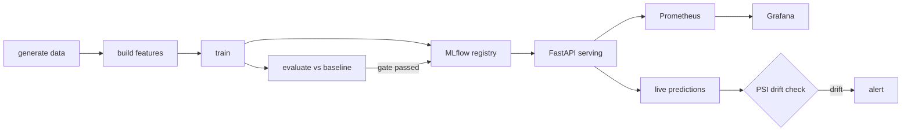

<div align="center">

# mlops-pipeline — End-to-End ML Model Lifecycle

A production-shaped MLOps showcase: **data → features → training → experiment tracking → model registry → serving → monitoring**.

**Python 3.12 · scikit-learn · MLflow · DVC · FastAPI · Prometheus/Grafana · Docker · GitHub Actions**

[](https://github.com/krish10021995/mlops-pipeline/actions/workflows/ci.yml)
[](https://www.python.org)
[](https://mlflow.org)
[](LICENSE)

</div>

---

## What this demonstrates

The problem framed for clients and hiring managers: **"take a model from a notebook to a
served, monitored, versioned API — the whole lifecycle, not a demo."**

- **Experiment tracking + model registry** with MLflow — every run logged, every model
  versioned, staged, and promotable.
- **Reproducible pipelines** with DVC (`dvc repro` re-runs only what changed).
- **Model over baseline** — evaluation gates the promotion of a model that must beat a
  naive baseline, or it is blocked.
- **Live serving** on FastAPI with Prometheus metrics (QPS, latency, prediction value) and a
  prebuilt Grafana dashboard.
- **Drift detection** — PSI between the trained fare distribution and live predictions fails
  the drift job when the distribution shifts.
- **CI/CD** — lint, unit tests, and an end-to-end data→evaluate smoke run on every push;
  a manual ECS deploy workflow builds and pushes to ECR.

## Architecture



## Quick start

Prerequisites: Python 3.11+.

```bash
pip install -e ".[dev]"   # or: make install
mlops-data                # 50k synthetic NYC taxi trips
mlops-features            # feature engineering + cleaning
mlops-train               # train + log to MLflow  (add --register to promote)
mlops-evaluate --gate     # compare vs baseline, gate the result
```

Windows users (no `make`): run the `mlops-*` commands above directly in PowerShell.

### Serve the model

```bash
mlops-serve               # http://localhost:8000  (Swagger UI at /docs)
```

```bash
curl -X POST http://localhost:8000/v1/predict \
  -H "Content-Type: application/json" \
  -d '{"pickup_datetime":"2024-11-10T09:30:00","dropoff_datetime":"2024-11-10T09:48:00","trip_distance":6.2,"passenger_count":2}'
```

### Monitoring stack (Docker)

```bash
docker compose up --build -d
# MLflow UI     -> http://localhost:5000
# API + /docs   -> http://localhost:8000
# Prometheus    -> http://localhost:9090
# Grafana       -> http://localhost:3000   (dashboard "Taxi Fare API" pre-provisioned)
```

### Drift check

Every prediction is appended to `data/predictions/live.csv`. Run the drift job to compare
the live distribution against the trained distribution:

```bash
mlops-drift            # exits non-zero if PSI > 0.2
```

## Project structure

```
config/                 # runtime configuration (YAML)
pipelines/              # DVC pipeline + params
src/mlops/
  data/                 # data generation (swap source: synthetic -> real TLC parquet)
  features/             # feature engineering + cleaning
  models/               # split, train, evaluate, predict
  serving/              # FastAPI app, Prometheus metrics, PSI drift detection
tests/                  # unit tests for every stage
monitoring/             # prometheus config + provisioned Grafana dashboard
deploy/                 # ECS task definition template + CD workflow
.github/workflows/      # CI (push) + CD (workflow_dispatch -> ECR/ECS)
```

## Production notes

- **Data versioning:** swap `mlops-data` for a real NYC TLC parquet source and track it with
  DVC (docs in `pipelines/dvc.yaml`).
- **Registry:** use an MLflow server (Postgres backend) for multi-user staging → production
  promotion. Locally, SQLite is fine.
- **Deploy:** `cd.yml` builds the Docker image, pushes to ECR, and redeploys an ECS Fargate
  service — replaceable with a GitOps path (ArgoCD) which lives in the [AWS GitOps repo].
- **Secrets:** never commit env files; use a real secret manager in production.

## Live demo

*Coming soon — 60s screencast + deployed endpoint.*

---

This is project #1 of a [7-project portfolio](https://github.com/krish10021995). The [Nova](https://github.com/krish10021995/nova)
analytics dashboard is the hub linking every repo.

Built by [Krishnendu Pramanik](https://github.com/krish10021995). Synthetic data is generated for illustration only.